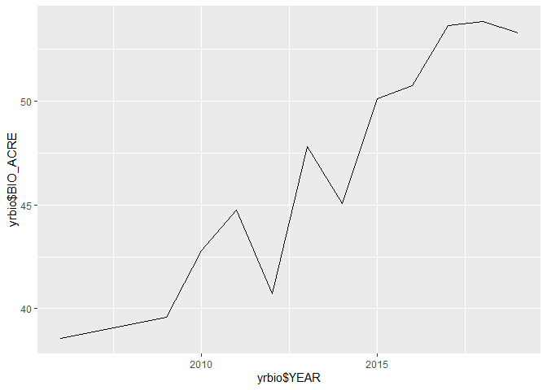

first we need to load the packages

```r
library(rFIA)
library(dplyr)
```

```
## 
## Attaching package: 'dplyr'
```

```
## The following objects are masked from 'package:stats':
## 
##     filter, lag
```

```
## The following objects are masked from 'package:base':
## 
##     intersect, setdiff, setequal, union
```

```r
library(tidyverse)
```

```
## -- Attaching packages --------------------------------------- tidyverse 1.3.0 --
```

```
## v ggplot2 3.3.3     v purrr   0.3.4
## v tibble  3.0.6     v stringr 1.4.0
## v tidyr   1.1.2     v forcats 0.5.1
## v readr   1.4.0
```

```
## -- Conflicts ------------------------------------------ tidyverse_conflicts() --
## x dplyr::filter() masks stats::filter()
## x dplyr::lag()    masks stats::lag()
```
then we can remotely add MS FIA data

```r
getFIA(c('MS'), dir = 'name', load = FALSE)
```

```
## Creating directory: name/
```

```
## Saving to name/. NOTE: modifying FIA tables in Excel may corrupt csv files.
```

```r
MS <- readFIA('name', inMemory = FALSE)
```
next, lets try some of the functions mentioned on the website

```r
#must first define db at fia 
biomass(db = MS)
```

```
## Warning: The `.dots` argument of `group_by()` is deprecated as of dplyr 1.0.0.
## This warning is displayed once every 8 hours.
## Call `lifecycle::last_warnings()` to see where this warning was generated.
```

```
## # A tibble: 12 x 7
##     YEAR BIO_ACRE CARB_ACRE BIO_ACRE_SE CARB_ACRE_SE nPlots_TREE nPlots_AREA
##    <int>    <dbl>     <dbl>       <dbl>        <dbl>       <dbl>       <dbl>
##  1  2006     38.6      19.3        1.26         1.26        3538        3665
##  2  2009     39.0      19.5        1.24         1.24        3548        3666
##  3  2010     39.5      19.7        1.24         1.24        3547        3670
##  4  2011     40.2      20.1        1.23         1.23        3537        3668
##  5  2012     40.7      20.4        1.22         1.22        3539        3665
##  6  2013     41.7      20.8        1.21         1.21        3545        3668
##  7  2014     42.7      21.4        1.13         1.13        3835        3944
##  8  2015     44.2      22.1        1.11         1.11        3885        3989
##  9  2016     45.8      22.9        1.09         1.09        3937        4038
## 10  2017     48.2      24.1        1.06         1.06        3935        4033
## 11  2018     50.6      25.3        1.04         1.04        3920        4013
## 12  2019     52.2      26.1        1.04         1.04        3895        3996
```

```r
## By species
biosp<-biomass(MS, bySpecies = TRUE)

## Alternative estimators (annual panels)
yrbio<-biomass(MS, method = 'ANNUAL')

#plot of biomass/acre/yr
ggplot(yrbio, aes(x= yrbio$YEAR, y= yrbio$BIO_ACRE))+ geom_line()
```

```
## Warning: Use of `yrbio$YEAR` is discouraged. Use `YEAR` instead.
```

```
## Warning: Use of `yrbio$BIO_ACRE` is discouraged. Use `BIO_ACRE` instead.
```

<!-- -->

